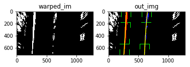

---
## 1st. compute the camera calibration using chessboard images

---
## 2nd. Apply a distortion correction to raw images
* use objpoints and imgpoints caculated in above cell
* skip calibrateCamera calculation once the data is ready to improve perfomace

---
## 3rd.  Create a thresholded binary image
* use sobel operator to creat a horizonal direction binary image
* use magnitude threshold filter to creat a binary image
* use gradient direction threshold filter to creat binary image
* use channel S of color space HLS to filter to get a binary image

---
## 4th. Apply a perspective transform to rectify binary image ("birds-eye view")
* wrap image
* combine threshold and wrap functions as a whole

---
## 5th. Detect lane pixels and fit to find the lane boundary
* firstly, use window histgram to search the lane line in a wrapped and thresholded image
* when got a efficient lane line, next frames can be detected simply

---
## 6th. Determine the curvature of the lane and vehicle position with respect to center
* sannity check with left and right lines
* write text to image upper left
* calculate curvature
* draw line on image and wrap back to source image
